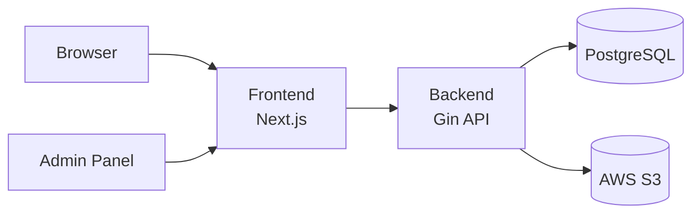

# Computer Engineering — KMITL PCC

เว็บแอปพลิเคชันภาควิชาวิศวกรรมคอมพิวเตอร์  
สถาบันเทคโนโลยีพระจอมเกล้าเจ้าคุณทหารลาดกระบัง · **วิทยาเขตชุมพรเขตรอุดมศักดิ์**

เว็บไซต์สาธารณะ + ระบบสมาชิกภายในสาขา + แผง Admin สำหรับจัดการเนื้อหา ข่าวสาร แบบทดสอบ และ Exit Exam

---

<p align="center">
  
  
  
  
  
</p>

---

## Highlights

| กลุ่ม | สิ่งที่ทำได้ |
|--------|-------------|
| **สาธารณะ** | Hero วิดีโอแนะนำ · About Us · หลักสูตร · บุคลากร · ผลงานนักศึกษา · ข่าวสาร |
| **สมาชิก CE** | เข้าสู่ระบบ (JWT / Google) · เมนูภายในสาขา · Quiz / Exit Exam |
| **Admin** | จัดการ content · ข่าว · สื่อ · whitelist · ข้อสอบ |

---

## Tech Stack

```text
Frontend   Next.js 15 · React 19 · Tailwind CSS 4 · shadcn/ui
Backend    Go 1.24 · Gin · GORM
Database   PostgreSQL 16
Storage    AWS S3 (อัปโหลดรูป / วิดีโอ / PDF)
Infra      Docker Compose · pgAdmin
```

---

## Architecture



---

## Quick Start

### 1) เตรียม environment

```bash
cp .env.example .env
```

แก้ค่าใน `.env` ตามเครื่องคุณ (พอร์ต, JWT, Google OAuth, AWS S3 ถ้ามี)

> ใช้ **ไฟล์ `.env` ที่ root ไฟล์เดียว** — Docker / Frontend / Backend อ่านร่วมกัน

### 2) รันทั้งระบบด้วย Docker

```bash
docker compose up --build
```

| บริการ | URL |
|--------|-----|
| Frontend | http://localhost:`FRONTEND_HOST_PORT` (ค่าเริ่มต้น `3000`) |
| Backend health | http://localhost:`BACKEND_HOST_PORT`/health (ค่าเริ่มต้น `8080`) |
| pgAdmin | http://localhost:`PGADMIN_HOST_PORT` (ค่าเริ่มต้น `5050`) |
| Postgres (จากเครื่อง) | `localhost`:`POSTGRES_HOST_PORT` |

**pgAdmin**
- Login ด้วย `PGADMIN_DEFAULT_EMAIL` / `PGADMIN_DEFAULT_PASSWORD`
- ต่อ DB: Host `db` · Port `5432` · ใช้ค่า `POSTGRES_*`

### คำสั่งที่ใช้บ่อย

```bash
# ทั้งระบบ
docker compose up --build

# เฉพาะ frontend
docker compose up --build frontend

# backend + database
docker compose up --build db backend

# หยุด
docker compose down
```

---

## รันแบบ Local (ไม่ใช้ Docker)

ต้องมี PostgreSQL รันอยู่ (หรือใช้ `docker compose up -d db`) แล้วตั้ง `DATABASE_URL` ใน `.env`

**Frontend**

```bash
cd frontend
npm install
npm run dev
```

**Backend**

```bash
cd backend
go mod tidy
go run ./cmd/server
```

---

## Project Structure

```text
.
├── frontend/               # Next.js App Router
│   └── src/
│       ├── app/            # routes — (site) / admin / auth / exam
│       ├── features/       # domain features (home, content, news, …)
│       ├── components/     # UI ร่วม (navbar, admin, shadcn)
│       └── lib/api/        # API client
├── backend/
│   ├── cmd/server/         # entrypoint
│   └── internal/           # handlers · services · repositories · dto
├── docs/                   # API docs · schema · migrate
├── docker-compose.yml
├── .env.example
└── teamproject1.sql        # seed / dump อ้างอิง
```

---

## Documentation

| เอกสาร | เนื้อหา |
|--------|---------|
| [`docs/auth-api.md`](docs/auth-api.md) | Auth / JWT / Google login |
| [`docs/s3-upload.md`](docs/s3-upload.md) | อัปโหลด & ลบไฟล์บน S3 |
| [`docs/quiz-exam-api.md`](docs/quiz-exam-api.md) | Quiz & Exit Exam |
| [`docs/migrate.md`](docs/migrate.md) | Migration / DB |
| [`docs/schema.dbml`](docs/schema.dbml) | Database schema |
| [`docs/feature-descriptions.md`](docs/feature-descriptions.md) | ฟีเจอร์ตามบทบาทผู้ใช้ |

---

## Environment (สรุป)

| กลุ่ม | ตัวแปรสำคัญ |
|--------|-------------|
| Database | `POSTGRES_*` · `DATABASE_URL` |
| App URL | `FRONTEND_URL` · `NEXT_PUBLIC_API_URL` · พอร์ต `*_HOST_PORT` |
| Auth | `JWT_SECRET` · `JWT_EXPIRE_HOURS` · `GOOGLE_CLIENT_ID` |
| S3 | `AWS_REGION` · `AWS_ACCESS_KEY_ID` · `AWS_SECRET_ACCESS_KEY` · `AWS_S3_BUCKET` |

รายละเอียดเต็มอยู่ที่ [`.env.example`](.env.example)

---

## Team

โปรเจกต์วิชา **Project / Web Application** — ภาควิชาวิศวกรรมคอมพิวเตอร์ KMITL PCC

---

<p align="center">
  <sub>Built with Next.js · Go · PostgreSQL</sub>
</p>
